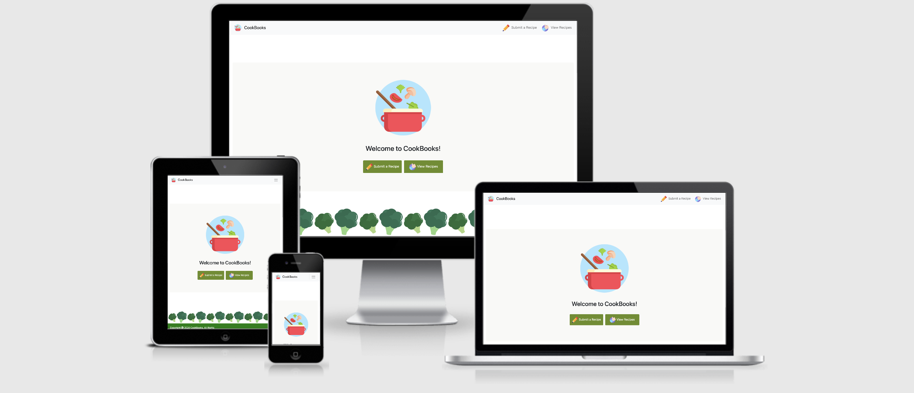

# Python and Data Centric Development
### Welcome to CookBooks

[Cookbooks](https://cookbooks-recipes.herokuapp.com/)<br>
[My Github Page](https://github.com/suchan5/Project-3)

This website is designed and developed for users who are interested in cooking.

It enables the users to share their own cook recipes with the community, and benefit from having convenient access to the data provided by other users.

It comprises of two main sections which are to submit their recipes and to view those receipes they submitted.<br>
Users can also view all the other recipes submitted by other users and can freely add comments, edit or delete posts. (No authetication required).


# Technologies used
* HTML5 - It was used to build the structure of the website.
* CSS3 - It was used to give design effects and style to the website. Also, media query was used for responsive design purpose.
* JavaScript - It was used to make the website more dynamic and interactive.
* Python + Flask - Python was used to build the database-backed Flask web application.
* [MongoDB](https://www.mongodb.com) - Non-relational database, MongoDB, was used for designing a database structure, and data was stored in MongoDB Atlas (Cloud)
* [jQuery 3.5.0](https://jquery.com) - It was used to make it easier to use JavaScript.
* [Bootstrap 4.4](https://getbootstrap.com) - It was used for structure and style for the website with responsive design for different media sizes.
* [Font Awesome](https://fontawesome.com) - It was used for concise and intuitive design effect with using icons.
* [Cloudinary](https://cloudinary.com/) - It was used for image uploading function
* [DISQUS](https) - It was used for commenting function

# Data Structure

Data structure of Cookbooks consists of two collections which are 'submittedRecipes' and 'cuisines'.
#### When users add new recipes to the website, the data will be stored in the collection 'submittedRecipes'. It includes fields such as:
- Title of the recipe
- About the recipe (short introduction about the recipe)
- Ingredients
- Prep time
- Cook time
- Servings
- Cuisine
- Direction
- Uploaded image

#### A separate collection named 'cuisines' is created to store data of cuisine types so that it enables the users to filter and view recipes easily by cuisine types:
- American
- Chinese
- French
- Italian
- Japanese
- Korean
- Thailand
- Others


# Structure of the website
[Wireframe](https://ovenapp.io/view/tl64LcZeN7PnZqOJiHJPfUW862T6BoNZ/gAYR6)
#### Each pages are interactive and intuitive which makes it easier for users to explore the contents throughout the website.
* 'Home' page is the first page the users see when they access the domain address. A big logo of the website is located in the centre with the two big buttons ('Submit a Recipe' and 'View Recipes') which gives the users a direct idea of what this website is built for.
* 'Submit a Recipe' page (CREATE) consists of a submission form. Users can fill up the blank with relevant information such as ingredients to share their recipes. Also, images can be uploaded if they want to.
* 'Board View' page (READ) is where users can view the recipe they have just submitted. Once submitted, the board view appears for users to check and view the recipe they have just created.
* 'Edit' page (UPDATE) is where users can edit or update the recipes. No authentication required. Anyone can access a recipe simply by clicking the recipe and also can click the edit button to update the selected recipe.
* 'Delete' page (DELETE) is where users can delete the recipes. Clicking the delete button leads to a confirmation alert page which prompts the users if they want to proceed with the deletion.
* 'View Recipes' page shows all recipes available in the website. Users can search any recipes with search terms or can view recipes by cuisines.


# UI/UX Design
This website is created with a focus on UI/UX that is:
1. Simple & clear :
- This is achieved by giving consistency in design throughout the website. Also, I gave enough spacing (padding and margin) for better readability of the contents.

2. Easy to use :
- Responsiveness : For example, font size is responsive to different device sizes so that users can use the website even on smaller devices.
- Placeholder, icons, buttons, flash messages are added to guide the users.

3. Presentable :
- A clean and theme-related image (broccoli) was chosen and incorporated as the background to improve the overall design.
- To give the texts a better visibility over the white background, I have added a translucent grey box so that the contents are more readable.
- Images are uniform in size and are not pixelated even in different media sizes.
- For fonts, black and dark gray were chosen as two main colours in order to give consistency in design.
- Preview images of the recipes are available on the 'View Recipes' page for intuitive effects.

## Features and functions added for improved UI/UX

#### Navbar : 
- A navbar is added on the top of the website for users' direct access to each sections. 
- Navbar shows the two main functions (Submit and View) so that the user can create or read their recipes anytime.
- Navbar is accessible from every page.

#### Giving guidance :
- Upon creating, editing and deleting of the recipes, a flash message appears to indicate that the action is performed succesfully (Flash messages disappear after some time).
- Placeholders give users an idea what to fill in the blanks in the submission form.

#### Preview of images :
- When submitting or updating the recipe, users can view the preview of the images that they are going to post or edit.
- Users can also view the name of the uploaded file before submitting to ensure that it is the correct file which they intend to post.

#### Search function :
- Users can search for the recipes with search terms.
- Users can use search terms irrelevant to the upper case or lower case.
- Results will be shown for both scenarios where the search term is in full or in partial strings.

#### View by categories :
- Users can view all the available recipes in the website by cuisines.

#### Recipes can be enlarged :
- For 'View Recipes' page, all the recipes which are displayed in the form of cards are enlarged upon mouseover to give users a better interactive experiences.

#### Button colours :
- Button colours change on mouseover.
- The function buttons are differentiated by colour which is applied consistently throughout the website.
(e.g. 'Save' buttons across templates are in blue, 'Cancel' buttons across templates are in black.)

#### Mouse cursor changes to pointer on click-able buttons

#### Commenting function added :
- Users can freely leave a comment on the recipe to share opinions with other users (acheived by using DISQUS).

#### Pagination :
- For 'View Recipes' page, each page is designed to display 12 cards (4 by 3 per page). When cards exceed twelve, it will automatically create a new next page. 
- Each block contains 5 pages. When pages exceed five, users can simply click the 'Next' button to view the next block.

#### Redirect :
- Users are redirected to the same page where they left off. For example, for a recipe in page 2 of pagination, after the user views it in detail and clicks the ‘go to list’ button, he/she will be redirected back to page 2.


## Features left to be implemented
- My current search engine searches through all the recipes by search terms. Alternatively, users can view the recipes by different cuisine types. For a more advanced search in future, I would like to combine these two functions whereby the results can be filtered by a search term within a type of cuisine.
- I would like to implement WYSIWYG editor such as Summernote to replace <textarea> tag used in the submission form.


# Responsive Design
The main purpose of the test on the responsive design is to ensure that the website works well and looks  organized in different media sizes. It was acheived by using Bootstrap, media query, and 'Inspect' function from Google Chrome.



# Codes I could not achieve : Pagination upon searching/viewing by cuisines

When I search for a recipe, for example 'tofu', and there is only one result, it is supposed to show page 1 only. However, the pagination is not functioning as intended where it still shows all the pages. Page 1 succesfully displays the search results as desired, but the other pages also appear regardless of the search results. Also when it was viewed by cuisines, same problem is detected.

As an attempt to solve the problem, I have tried to include the variables, 'search terms' and 'cuisine names', in href of pagination code so that it can be passed as parameters in query string. However it did not work. 
```html
<a href="{{url_for('show_all_recipes', page=i, search_terms=search_terms, cuisine_name=cuisine_name)}}" class="px-2 activePage">{{i}}</a>
```


# Deployment 
CookBooks is coded and developed in Gitpod, and deployed using a cloud based hosing platform, Heroku.

1. Sign up to Heroku account and login to Heroku using the terminal in Gitpod
```html
heroku login
```
2. Create the app name I am going to use. It must be unique and must avoid underscore
```html
heroku create <app name>
```
3. When a new remotes added, check it with the following :
```html
git remote -v
```
4. Install gunicorn
```html
pip3 install gunicorn
```
5. Create a file named "Procfile" (the P must be a capital letter)

6. Open 'Profile' in the editor and add the below :
```html
web gunicorn <my python file name without .py>:app
```
My python file name is 'app.py' so it should be as below:
```html
web gunicorn app:app
```
7. Create requirements file by using the terminal
```html
pip3 freeze --local > requirements.txt
```
8. Add, commit and push the changes 
```html
git add .
git commit -m "<my commit message>"
git push heroku master
```
9. Open the app from Heroku website or access via URL created : https://cookbooks-recipes.herokuapp.com/


#### Errors & differences detected after deployment
There is an error detected which did not occur when tested in Gitpod : Cloudinary is not working for uploading images.


No issue is noted when uploading a photo of a recipe from Gitpod. Whereas in the deployed website, the photo cannot be uploaded by Cloudinary. <br>
I have inquired the issue with Cloudinary and they suggested to try a code as below, but it did not resolve the issue. 
```html
<button id="upload_widget" class="cloudinary-button">Upload files</button>

<script src="https://widget.cloudinary.com/v2.0/global/all.js" type="text/javascript"></script>  

<script type="text/javascript">  
var myWidget = cloudinary.createUploadWidget({
  cloudName: 'dj7poh6mc', 
  uploadPreset: 'jvn95k4g'}, (error, result) => { 
    if (!error && result && result.event === "success") { 
      console.log('Done! Here is the image info: ', result.info); 
    }
  }
)

document.getElementById("upload_widget").addEventListener("click", function(){
    myWidget.open();
  }, false);
</script>
```
The issue still remains unresolved.

# Testing
#### Testing Purpose
* To ensure that there are no broken images or links.
* To ensure that the website is responsive on different devices.
* To ensure that the website runs well on different browsers.

I sent the deployed URL to friends and family to test whether the website works responsively without broken images or links in different screen sizes. Also, testing was done on different browsers to ensure that the website runs well.
#### Devices tested 
* Oppo R11
* iPhone XR
* iPhone 6S
* Galaxy S20+
* Galaxy Tab A
* MacBook Pro
* iPad Air 3rd Gen 
* HanSung Computer Ultron 2454C

#### Browsers tested 
* Google Chrome 
* Safari 
* Firefox 
* Internet Exporer 

##### No error detected, except Cloudinary error. Testing results are as expected.


## Credit

#### Images
* [Flaticon](https://www.flaticon.com/free-icon/) - for the icons used in navbar and logo
* [ac-illust](https://ac-illust.com/ko/) - for the broccoli image used in background

#### Recipes
* [Kim's Cravings](https://www.kimscravings.com/)
* [Xiachufang](https://www.xiachufang.com/)
* [Good Chef Bad Chef](https://www.goodchefbadchef.com.au/)
* [California Avocado](https://www.californiaavocado.com/recipes/recipe-container/california-avocado-chicken-burrito)
* [My Korean Kitchen](https://mykoreankitchen.com/)
* [China Sichuan Food](https://www.chinasichuanfood.com/)
* [Delicious.](https://www.delicious.com.au/)
* [McCormick](https://www.mccormick.com/)
* [The Spruce Eats](https://www.thespruceeats.com/)
* [Damn Delicious](https://damndelicious.net/)


#### Ackowledgement
* [W3schools](https://www.w3schools.com/css/css3_buttons.asp) - for 'Submit a Recipe' and 'All Recipes' buttons used in 'Home' page
* [W3schools](https://www.w3schools.com/css/tryit.asp?filename=trycss_ex_pagination_transition) - for the CSS design effects used in pagination
* [Inflearn](https://www.inflearn.com/) - for the reference tutorial for pagination
* [Yahya Elharony](https://www.elharony.com/remove-disqus-footer-also-on-sections-using-css/#:~:text=How%20to%20remove%20Disqus%20Footer,uncheck%20it%20if%20you%20want.) - for the CSS design effects to make footer of DISQUS to be not shown

## Disclaimer
This website is created for educational purpose only.
